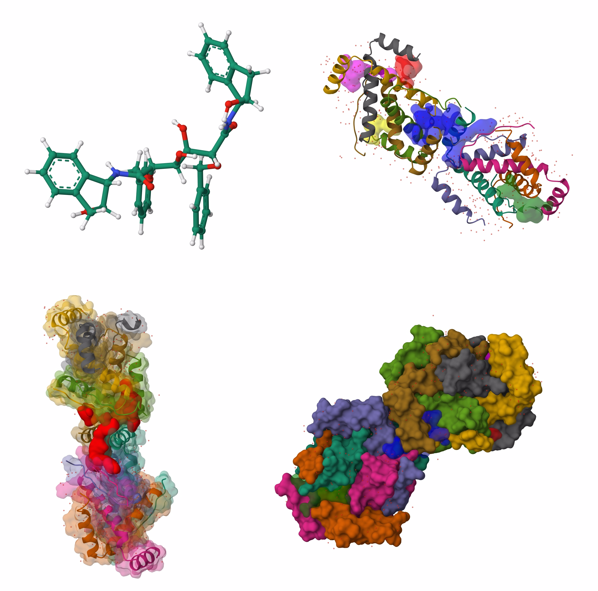

# Refactoring

# Code Refactoring Interview Challenge

## Introduction
This challenge involves refactoring a piece of Python code used to generate HTML for displaying molecular structures using the Mol* Viewer embedded in a webpage. The current implementation demonstrates numerous poor coding practices, making it an excellent candidate for refactoring.

## Problem Statement
The provided Python code generates HTML configured to visualize protein structures and their interactions with ligands and pockets in a web-based Mol* Viewer. The code suffers from several design and performance issues, and your task is to refactor it to enhance clarity, maintainability, and scalability.

## Code Description
The script constructs HTML embedded with JavaScript to interact with the Mol* API. Functions are defined to load different molecular components such as proteins, ligands, and pockets into the viewer with specific visualization styles. The current implementation mixes HTML template strings with Python logic in a tightly coupled manner, complicates file handling, and uses hard-coded paths and settings.

### Key Functions
- `loadLigand(viewer, data, format, dataLabel, ligand_type)`: Loads ligand data into the viewer.
- `loadStructureExplicitly(viewer, data, format, dataLabel, style_type, surface_alpha)`: Loads a protein structure with various visualization options.
- `loadStructureAndPockets(viewer, pocketDataList, pocketFormat, pocket_style_type, pocket_surface_alpha)`: Loads the main protein structure along with associated pockets.

## Image Expectations
The provided screenshots illustrate the expected visual outputs from the Python methods in the code. These images display various molecular visualization styles such as space-filling models, ribbon diagrams, and ball-and-stick models, highlighting different aspects of molecular interactions and structures. The refactored code should continue to support these visual outputs, demonstrating the effectiveness of the visualization methods being used.

1. **Molecular Structure Representation (Ball-and-Stick Model):**
2. **Protein and Pockets (Ribbon and Surface Representation):**
3. **Protein Surface and Single Pocket (Mixed Representation):**
4. **Protein Surface Representation (Full Surface Model):**

## Requirements for Refactoring
1. **Desingn** yourself.
2. **Image Expectations** should be met.

## Expected Deliverables
Refactor the provided code to meet the above requirements and provide documentation on the changes made. Your refactored code should still fulfill its original purpose but be more efficient, readable, and easier to maintain.

## Additional Notes
- Ensure your refactored solution is easy to understand and well-documented.
- Think critically about the structure and design patterns that would best suit this type of application.
- Consider the scalability of your solution; the code should be open for the extension.